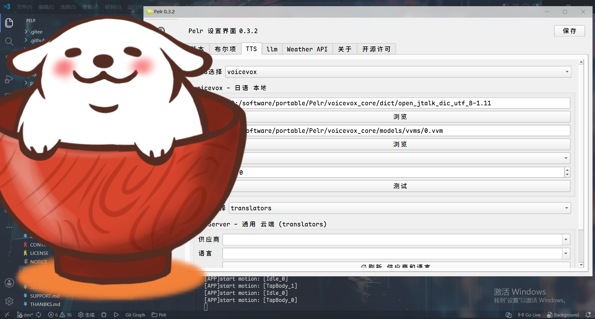
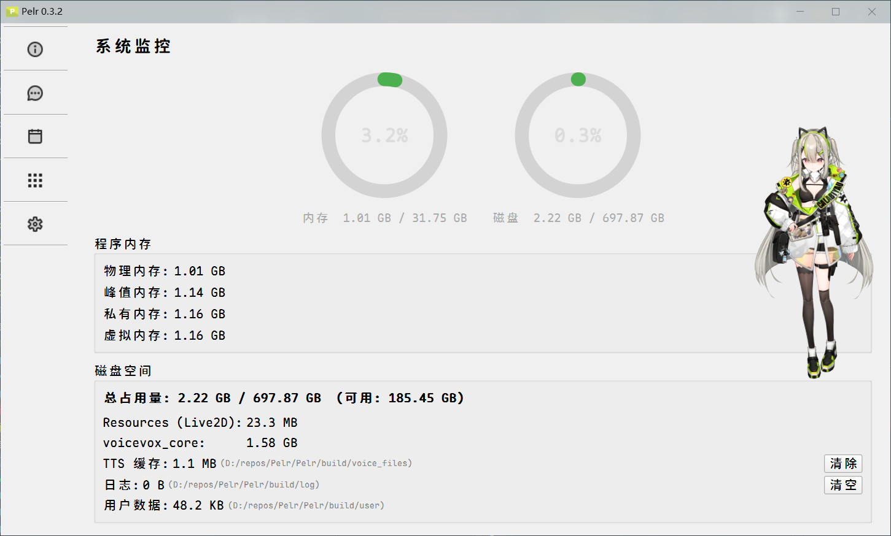
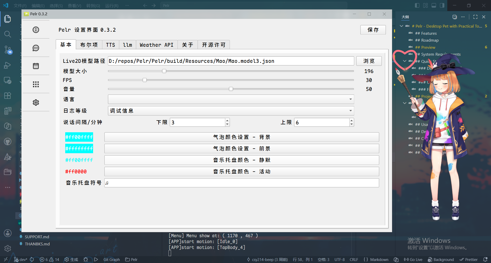

# Pelr - 工具向桌宠

[English](../README.md)


**Pelr** 是一款基于 Live2D 技术的智能桌面虚拟伙伴，集成 AI 对话、语音合成、快捷启动、TODO 管理和个性化桌面伴侣等功能。

> [!NOTE]
> 本项目处于开发阶段，功能与稳定性可能不足。
>
> 非盈利开源项目，任何人可免费使用。
> GitHub 为唯一发布源，SourceForge 和 Gitee 已废弃。

> [!WARNING]
> 本项目不含 Live2D Cubism Core。根据 Live2D 专有软件许可协议，Core 禁止公开分发。
> 使用者必须从 [Live2D 官网](https://www.live2d.com/zh-CHS/sdk/download/native/) 自行下载 SDK。
> Pelr 属于"可扩展性应用程序"，若自行编译后分发，需自行承担获取 Live2D 出版许可的责任。

## 主要特性

- **Live2D 虚拟角色** - 支持 model3.json 格式，提供生动的桌面伴侣体验
- **智能对话** - 兼容 OpenAI 的 AI 服务，支持自然语言交互
- **表情动作** - 支持模型自带的表情与动作切换
- **语音合成与唇形同步** - 内置 Edge TTS、讯飞 TTS、VOICEVOX 和 OpenAI-Compatible TTS，播放语音时模型自动模拟嘴部动作
- **TODO 管理** - 添加事件并提醒待办
- **启动管理** - 可视化管理系统启动项，支持启动任意文件与链接（继承自 [QuickTray](https://github.com/Pfolg/QuickTray)）
- **键盘监听** - 实时显示按键状态（继承自 [KeyMonitor](https://github.com/Pfolg/KeyMonitor)）
- **音乐托盘** - 托盘图标随系统音量旋转（继承自 [Rotating Rhythm](https://gitee.com/Pfolg/Rotating-Rhythm)）
- **天气服务** - 集成 OpenWeather，实时获取天气信息
- **系统监控** - 实时内存与磁盘占用监测，含详细占用分析
- **高度可定制** - 丰富的设置选项，满足个性化需求

## Roadmap

- [ ] 快捷键支持
- [ ] 热加载用户配置
- [ ] PMX 模型支持（计划引入 [saba](https://github.com/benikabocha/saba)）
- [ ] 多语言 UI（低优先级）

## 预览

<details>
<summary>点击展开</summary>
<div style="display: flex; overflow-x: auto; gap: 10px; padding: 10px; background: #f5f5f5; border-radius: 8px;">
  
  
</div>
  <div style="display: flex; overflow-x: auto; gap: 10px; padding: 10px; background: #f5f5f5; border-radius: 8px;">
  
  
</div>
</details>

## 系统要求

- **操作系统**: Windows 10/11（仅支持 Windows）
- **处理器**: 双核或更高
- **内存**: 4GB RAM 或更多
- **存储空间**: 至少 500MB
- **显卡**: 支持 OpenGL 3.0 及以上

## 快速开始

### 下载安装

使用方法见 [docs/index.md](index.md)

### TTS 后端

- **Edge TTS / 讯飞 TTS** — 依赖外部 Python 服务 [Pelr_tts_tr](https://github.com/igugyj/Pelr_tts_tr)，不提供打包版本
- **VOICEVOX** — 本地 TTS 引擎（随程序分发）
- **OpenAI-Compatible TTS** — 使用任意 OpenAI 兼容接口

### 更新

```sh
git fetch && git pull
```

依据 [CMakeLists.txt](../CMakeLists.txt) 更新依赖。

### 首次运行配置

1. **设置 Live2D 模型路径**（必需）
   - 在设置 -> 基本设置中配置模型路径
   - 支持 model3.json 格式
   - 模型下载：[Booth](https://booth.pm) | [模之屋](https://www.aplaybox.com/)

2. **配置 TTS 服务**（可选）
   - 推荐使用免费的 Edge TTS，无需额外配置
   - 也支持 VOICEVOX 和 OpenAI-Compatible TTS
   - 按需申请 [讯飞开放平台](https://www.xfyun.cn/) 账号
   - 在设置 -> TTS 配置中填写 API 凭证

3. **设置 AI 服务**（可选）
   - 选择 OpenAI 兼容的 AI 服务提供商

> [!CAUTION]
> 请勿在任何平台上传 `user` 文件夹中的内容。

## 项目结构

详细说明见 [docs/dev-structure.md](dev-structure.md)

<details>
<summary>架构总览</summary>

```txt
+---------------------------------------------------------------+
|                        Pelr 桌面应用                           |
+---------------------------------------------------------------+
|                                                                 |
|  main.cpp (入口)                                               |
|    |                                                            |
|    +-- core          (系统托盘、启动管理、窗口控制)             |
|    +-- ui            (Qt 界面：设置、聊天、TODO、系统监控、编辑……)        |
|    +-- ai            (OpenAI 兼容 API 对话)                     |
|    +-- tts           (语音合成调度：voicevox/讯飞/Edge TTS/OpenAI-Compatible)     |
|    +-- translation   (翻译管理，使用 Qt Network)                |
|    |       └── 腾讯翻译 (通过 Qt 调用腾讯云 API)               |
|    |       └── LibreTranslate 等 (同上)                        |
|    +-- keyboard      (键盘状态监听与提示)                       |
|    +-- model         (Live2D 模型扩展、额外动作/文件)           |
|    +-- utils         (日志、天气、网络、频谱分析、存储信息、进程内存……)             |
|    |       └── kissfft 用于 AudioSpectrumDetector，            |
|    |            实时分析系统音频 -> 驱动托盘图标旋转            |
|    +-- compatLApp    (Live2D 渲染封装层)                        |
|                                                                 |
+---------------------------------------------------------------+
                               |
                               | 依赖
                               v
+---------------------------------------------------------------+
|                        第三方库                                |
+---------------------------------------------------------------+
|                                                                 |
|  Qt 6.10.1          (GUI、网络、多媒体、串口……)                  |
|  Live2D Cubism Native Framework                               |
|  Live2D Cubism Core (DLL)      (禁止分发，需自行获取)         |
|  GLEW / GLFW       (OpenGL 环境)                               |
|  kissfft           (轻量 FFT：音频频谱分析 -> 音乐托盘)        |
|  voicevox_core     (C API，本地 TTS 引擎)                     |
|  ONNX Runtime      (随 voicevox_core 提供，推理)              |
|  stb               (图像加载)                                  |
|                                                                 |
+---------------------------------------------------------------+
                               |
                               | 部分模块网络调用
                               v
+---------------------------------------------------------------+
|                    外部服务 / 辅助进程                         |
+---------------------------------------------------------------+
|                                                                 |
|   OpenAI 兼容 API    (AI 对话)                                |
|   OpenAI-Compatible TTS (备选 TTS 后端)                      |
|   讯飞云 TTS API     (备选 TTS 后端)                          |
|   OpenWeather API    (天气数据)                                |
|   腾讯云翻译 API     (通过 Qt Network 直接访问)               |
|   LibreTranslate 等   (同上)                                   |
|                                                                 |
|   Python TTS 服务 (独立进程，仅用于 Edge TTS 和部分翻译)      |
|      ├── Edge TTS (OpenAI 兼容音频接口)                       |
|      └── 讯飞 TTS 的 HTTP 封装 (部分场景)                     |
|                                                                 |
+---------------------------------------------------------------+
```

</details>

## 技术栈

第三方声明见 [NOTICE](../NOTICE)。

### C++ 核心组件

- **Qt 6.10.1** - 跨平台应用框架
- **OpenGL** - 图形渲染（GLEW + GLFW）
- **Live2D Cubism** - 2D 动画渲染引擎（model3.json）
- **STB** - 图像处理
- **VOICEVOX** - 免费中高质量 TTS
- **kissfft** - 实时频谱分析与音频检测

### Python 工具链（可选）

依赖列表见 [Pelr_tts_tr/requirements.txt](https://github.com/igugyj/Pelr_tts_tr/blob/main/requirements.txt)

## 使用指南

- **主界面导航**: 使用左侧侧边栏切换功能模块
- **聊天功能**: 在聊天界面输入消息或双击角色显示对话框
- **启动项管理**: 管理自定义启动程序

详细功能说明见 [docs/index.md](index.md)

## 开发构建

简要开发指南见 [docs/dev-dev.md](dev-dev.md)

## 参与贡献

- [报告 Bug 与提出建议](https://github.com/igugyj/Pelr/issues)
- [提交 Pull Request](https://github.com/igugyj/Pelr/pulls)
- [项目文档](.)

## 许可证

部分组件使用不同许可证：

- Live2D Cubism SDK 使用[专有许可证](https://www.live2d.com/zh-CHS/sdk/download/native/)
- Qt 框架使用 [LGPL/GPL 许可证](https://www.qt.io/development/download)
- 其他第三方库详见 [NOTICE](../NOTICE)
- `src` 目录内由本项目开发者编写的部分采用 MIT 许可证
- `thirdParty/LAppLive2D` 与 `src/compatLApp` 源码改写自 `CubismNativeSamples`，为官方 Samples 衍生品，遵循 Live2D Open Software License
- 本项目受以上所有许可证约束

## 致谢

- [Live2D Cubism](https://www.live2d.com/) - Cubism Native Framework 与 Core，实现 2D 动画表现
- [Qt 框架](https://www.qt.io/) - 跨平台 C++ 开发框架
- [GLEW](http://glew.sourceforge.net/) - OpenGL 扩展加载库
- [GLFW](https://www.glfw.org/) - 窗口与 OpenGL 上下文管理
- [kissfft](https://github.com/mborgerding/kissfft) - 快速傅里叶变换库
- [miniaudio](https://github.com/mackron/miniaudio) - 单文件音频解码库
- [stb](https://github.com/nothings/stb) - 单头文件图像处理库
- [VOICEVOX CORE](https://github.com/VOICEVOX/voicevox_core) - 免费中高质量 TTS 引擎
- [ONNX Runtime](https://github.com/microsoft/onnxruntime) - 机器学习推理引擎
- [llama.cpp](https://github.com/ggml-org/llama.cpp) - 本地 AI 模型部署
- [openai-edge-tts](https://github.com/travisvn/openai-edge-tts) - OpenAI 兼容 Edge TTS 接口
- 讯飞开放平台 - 高质量语音合成服务
- [Hiroshiba Kazuyuki](https://github.com/Hiroshiba) - VOICEVOX 创始人
- Live2D Inc. - Cubism 技术提供方
- 所有贡献者与使用者的支持
