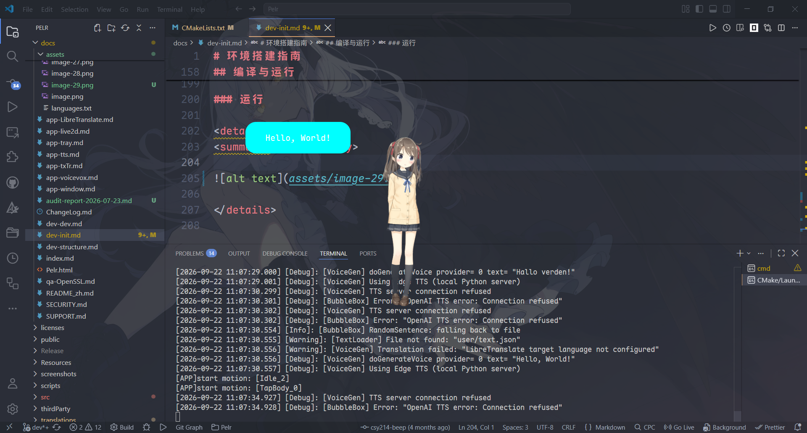

# 环境搭建指南

本文档指导开发者在 Windows 10/11 系统上完成本项目的环境配置和成功运行。

本项目依赖较为复杂，请在开始前审慎评估是否满足以下要求。

---

## 前置要求

- Microsoft Visual Studio 2022（C++ 开发环境）
- Visual Studio Code（或其他 IDE，建议安装 CMake Tools 扩展）
- Python 3.11（可选）
- Git
- Qt 6.10.1（CMake）

以上软件的安装方法请参考各官方文档。

## 依赖情况

- voicevox_core 0.17.0
- CubismSdkForNative-5-r.5

其他依赖请查看git子模块情况，如有新提交，请不要直接拉取，应当在测试通过后更新，不保证最新依赖能成功工作。

> 有更新？[催更本项目的懒虫作者](https://github.com/igugyj/Pelr/issues)

## 系统要求

- 至少 **6 GB** 可用存储空间（本项目所需）
- 约 **20 GB** Visual Studio 2022 C++ 开发环境（仅需其编译输出的资源文件，本项目不由该 IDE 开发）

## 下载源代码

通过 Git 克隆仓库：

```shell
git clone --depth 1 https://github.com/igugyj/Pelr.git
```

或使用 SSH：

```shell
git clone --depth 1 git@github.com:igugyj/Pelr.git
```

进入项目目录并初始化子模块：

```shell
cd Pelr
git submodule update --init --recursive
```

如需在克隆时一步到位：

```shell
git clone --depth 1 --recursive https://github.com/igugyj/Pelr.git
```

---

## 第三方库配置

### VoiceVox Core

参考 [VoiceVox 配置指南](app-voicevox.md)。

1. 前往 [voicevox_core 0.17.0  发布页面](https://github.com/VOICEVOX/voicevox_core/releases/tag/0.17.0)
2. 下载 `download-windows-x64.exe`
3. 运行该程序，将生成的 `voicevox_core` 文件夹按以下结构放置：

推荐目录结构：

- `thirdParty/voicevox_core/c_api`
- `thirdParty/voicevox_core/onnxruntime`
- `Resources/voicevox_core/dict`
- `Resources/voicevox_core/models`

也可将整个 `voicevox_core` 文件夹同时放置于 `thirdParty` 和 `Resources` 目录。

---

### Cubism Core

根据 Live2D 专有软件许可协议，本项目**不提供**该文件。

下载地址：<https://www.live2d.com/zh-CHS/sdk/download/native/>

本项目通常支持最新版本的 Cubism Core。

1. 下载 `CubismSdkForNative-5-r.5.zip`
2. 将 `Core` 文件夹放置于 `thirdParty` 目录下
3. 保留 SDK 目录的完整性，不要直接剪切

### GLEW、GLFW、STB

运行配置脚本：

```
thirdParty/scripts/setup_glew_glfw.bat
```

脚本执行成功即表示配置完成。

---

## 资源文件

`Resources` 目录用于存放运行时资源。这些文件不会被编译进二进制文件，而是在构建过程中复制到输出目录。

**VoiceVox 词典目录：**
`Resources/voicevox_core/dict`

**VoiceVox 模型目录：**
`Resources/voicevox_core/models`

**Live2D 资源：**

需在 `Resources/` 目录下包含以下文件夹：

- `Resources/FrameworkShaders`
- `Resources/Resources`
- `Resources/SampleShaders`

以上文件可从 Cubism SDK 获取：

1. 进入 `CubismSdkForNative-5-r.5\Samples\OpenGL`
2. 运行 `thirdParty\scripts\setup_glew_glfw.bat` 配置第三方库（该脚本与项目 `thirdParty` 目录下的脚本相同）
3. 进入 `CubismSdkForNative-5-r.5\Samples\OpenGL\Demo\proj.win.cmake\scripts`
4. 运行 `proj_msvc2022.bat`（确保已正确安装 Visual Studio 2022）

5. 进入 `CubismSdkForNative-5-r.5\Samples\OpenGL\Demo\proj.win.cmake\build\proj_msvc2022_x64_mt`
6. 使用 Visual Studio 打开 `Demo.sln`
7. 构建解决方案（Debug 或 Release 配置均可）

<details>
<summary>预览</summary>


</details>

<details>
<summary>预览</summary>


</details>

<details>
<summary>预览</summary>


</details>

1. 构建成功后，进入 `proj_msvc2022_x64_mt\bin\Demo\Debug`（或 `Release`）
2. 复制以下三个文件夹到项目的 `Resources` 目录：
   - `FrameworkShaders`
   - `Resources`
   - `SampleShaders`

资源配置完成。

---

## 编译与运行

### 配置 CMake

编辑 `.vscode\settings.json`，确保 Qt MinGW 路径指向本地安装目录：

```json
"cmake.configureArgs": [
   "-DCMAKE_PREFIX_PATH=D:/Qt/6.10.1/mingw_64" // 修改为你的6.10.1/mingw_64路径
]
```

保存该JSON文件后，点击`CMakeLists.txt`并保存，若配置正确，Visual Studio Code 应输出（或类似消息）：

```txt
[cmake] -- Configuring done (1.4s)
[cmake] -- Generating done (0.6s)
[cmake] -- Build files have been written to: D:/repos/Pelr/Pelr/build/Debug
```

<details>
<summary>预览</summary>


</details>

### 构建

从 Visual Studio Code 或命令行启动构建。预期输出：

```
[build] Copying Resources/voicevox_core -> output directory
[build] [100%] Built target Pelr
[driver] Build completed: 00:07:28.258
[build] Build finished with exit code 0
```

退出代码为 0 表示构建成功。

如返回非零退出代码，请检查配置步骤。如确认配置正确，可向开发者提交问题，并附上完整构建日志。

### 运行

<details>
<summary>预览</summary>



</details>

## 发布

使用release模式构建后，需调整VSCode的`CMake插件`配置为：

```
- Configure
   - GCC 13.1.0 x86_64-w64-mingw32
   - Release
```

将`CMakeLists.txt`设置为release构建：

```
set(DEBUG_MODE OFF)           # ON: Debug, OFF: Release
```

点击构建，构建完成后在项目根目录运行：

```shell
py scripts\release.py
```

可修改[scripts\release_config.json](../scripts/release_config.json)以调整release构建的内容。

```shell
❮cmd❯  …\Pelr  dev [  ✓] via △ v4.2.3
の py scripts\release.py
NOTICE file generated successfully: D:\repos\Pelr\Pelr\NOTICE
[release] Removing existing target: D:\repos\Pelr\Pelr\Release
[release] Copied D:\repos\Pelr\Pelr\build/Release -> D:\repos\Pelr\Pelr\Release
[release] Copied file LICENSE -> D:\repos\Pelr\Pelr\Release\LICENSE
[release] Copied file NOTICE -> D:\repos\Pelr\Pelr\Release\NOTICE
[release] Copied file README.md -> D:\repos\Pelr\Pelr\Release\README.md
[release] Copied file SECURITY.md -> D:\repos\Pelr\Pelr\Release\SECURITY.md
[release] Copied file SUPPORT.md -> D:\repos\Pelr\Pelr\Release\SUPPORT.md
[release] Copied file THANKS.md -> D:\repos\Pelr\Pelr\Release\THANKS.md
[release] Copied dir  screenshots -> D:\repos\Pelr\Pelr\Release\screenshots
[DELETE] Cleaning: D:\repos\Pelr\Pelr\Release

  [dir]  Framework_autogen  (67 B)
  [dir]  glew_autogen  (62 B)
  [dir]  glfw_autogen  (62 B)
  [dir]  kissfft_autogen  (65 B)
  [dir]  miniaudio_autogen  (67 B)
  [dir]  Pelr_autogen  (1.7 MB)
  [dir]  .qt  (4.1 KB)
  [dir]  .cmake  (420.9 KB)
  [dir]  CMakeFiles  (60.9 MB)
  [dir]  log  (704 B)
  [dir]  user  (106 B)
  [dir]  voice_files  (0 B)
  [dir]  .lupdate  (25.8 KB)
  [dir]  _deps  (26.9 MB)
  [dir]  FluentUIStylePlugin-prefix  (3.7 KB)
  [file] libFramework.a  (983.9 KB)
  [file] libglew.a  (766.2 KB)
  [file] libglfw.a  (331.2 KB)
  [file] libkissfft.a  (12.9 KB)
  [file] libminiaudio.a  (975.6 KB)
  [file] cmake_install.cmake  (1.9 KB)
  [file] CMakeCache.txt  (66.5 KB)
  [file] compile_commands.json  (119.0 KB)
  [file] Makefile  (243.2 KB)
  [file] qrc_Resource.cpp  (85.5 MB)
  [file] Resource.qrc.depends  (21.8 KB)
  [file] language_en_US.qm  (5.2 KB)
  [file] language_zh_CN.qm  (33.4 KB)

Deleted 28 items, freed 178.9 MB.
[release] done.
[release] total time: 47.93 s
```

默认情况下，脚本会复制一些资源、许可文件，清理一些不需要的产物，将最终内容放在`Release`目录。

Release目录内便是一个完整的程序，可打包、分发等，但是需要遵循本项目的[约束协议](../README.md#License)。
